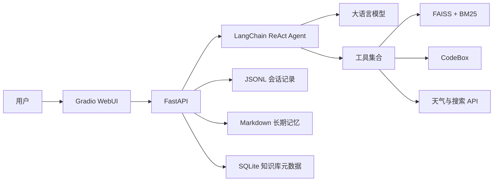

# 基于 Agent 的私人 AI 助理

一个面向学习与演示的私人 AI 助理项目。项目基于 **FastAPI、Gradio 和 LangChain ReAct Agent**，集成了工具调用、知识库 RAG、会话记忆、长期记忆、文件问答和 Python 代码执行等能力。

## Demo

▶️ [观看完整项目演示视频](https://github.com/lizheng20020914/react-agent-memory-assistant/releases/download/demo-v1.0/agent_test.mp4)

## 功能特性

- ReAct Agent 多轮推理与工具调用
- Gradio 聊天界面和流式回答
- JSONL 会话历史保存与历史会话恢复
- 对话过长时自动生成历史摘要
- Markdown 长期记忆
- FAISS + BM25 混合知识库检索
- 知识库创建、删除和文档上传
- 聊天附件读取与问答
- 天气查询、网络搜索和当前时间工具
- Python 代码执行与图片输出

## 系统架构



调用链：

```text
浏览器 → Gradio → FastAPI → ReAct Agent → 模型/工具 → 流式回答
```

## 技术栈

| 模块 | 技术 |
|---|---|
| Web 界面 | Gradio |
| API 服务 | FastAPI、Uvicorn |
| Agent | LangChain ReAct Agent |
| 聊天模型 | Qwen2.5-72B-Instruct（OpenAI 兼容接口） |
| Embedding | BAAI/bge-large-zh-v1.5 |
| 向量检索 | FAISS |
| 关键词检索 | BM25、jieba |
| 元数据 | SQLite、SQLAlchemy |
| 短期记忆 | JSONL、JSON 摘要 |
| 长期记忆 | Markdown |
| 代码执行 | CodeBox |

## 项目结构

```text
.
├── app_server.py                  # FastAPI 后端入口
├── webui.py                       # Gradio 前端入口
├── chat/
│   └── chat_routes.py             # Agent 聊天接口与执行流程
├── configs/
│   ├── prompt.py                  # ReAct Prompt
│   └── setting.py                 # 模型和目录配置
├── db_server/
│   ├── base.py                    # SQLite 模型和连接
│   └── knowledge_base_repository.py
├── knowledgebase_server/
│   ├── kb_routes.py               # 远程 Embedding 知识库接口
│   ├── kb_routes_local.py         # 本地 Embedding 备用接口
│   └── loader/loader.py           # 文档加载器
├── memory/
│   ├── session_manager.py         # JSONL 会话管理
│   └── memory_consolidator.py     # 历史摘要压缩
├── tools/                         # Agent 工具
├── utils/                         # 回调和文档读取工具
└── webui/                         # Gradio 的后端请求封装
```

运行后会创建或使用以下数据目录：

```text
knowledgebases/            FAISS 索引
data/                      知识库原始文件
temp/data/                 聊天附件
temp/medias/               代码生成的图片
memory/sessions/           会话记录和摘要
memory/long_term memory/   长期记忆
db_server/data/            SQLite 数据库
```

这些目录通常包含用户数据，不应提交到公开仓库。

## 环境要求

建议使用：

- Python 3.11
- 可访问所配置模型和工具 API 的网络环境
- 本地 Embedding 模式需要额外的模型文件和运行内存

## 安装

```bash
git clone https://github.com/<你的用户名>/<仓库名>.git
cd <仓库名>

python -m venv .venv
source .venv/bin/activate

pip install -r requirements.txt
```

Windows 激活虚拟环境：

```powershell
.venv\Scripts\activate
```

Markdown、PDF 和 BM25 检索还需要相应解析依赖。如果 requirements 中尚未包含，可以安装：

```bash
pip install unstructured markdown pypdf rank-bm25
```

使用本地 Embedding 时还需要：

```bash
pip install sentence-transformers
```

## 配置

### 模型配置

聊天模型及服务地址位于：

```text
configs/setting.py
```

当前默认模型：

```text
Qwen/Qwen2.5-72B-Instruct
```

当前后端在 `app_server.py` 中加载 `knowledgebase_server/kb_routes.py`，因此知识库使用远程 Embedding。若要切换到本地 Embedding，可改为导入：

```python
from knowledgebase_server.kb_routes_local import kb_router
```

切换 Embedding 实现后，建议重新创建并向量化知识库。

### API Key

项目使用的外部服务可能包括：

- 硅基流动聊天模型
- 硅基流动 Embedding
- 心知天气
- SerpAPI

**不要在源码或 Git 历史中提交真实 API Key。** 上传 GitHub 前，应将相关配置改为从环境变量读取，例如：

```python
import os

api_key = os.getenv("SILICONFLOW_API_KEY")
```

推荐使用的环境变量名称：

```env
SILICONFLOW_API_KEY=
EMBEDDING_API_KEY=
WEATHER_API_KEY=
SERPAPI_API_KEY=
```

`.env` 必须加入 `.gitignore`，仓库中只提交不含真实值的 `.env.example`。

## 启动项目

需要分别启动 FastAPI 后端和 Gradio 前端。

### 1. 启动 FastAPI

```bash
python app_server.py
```

后端默认地址：

```text
http://127.0.0.1:6605
```

FastAPI 文档：

```text
http://127.0.0.1:6605/docs
```

### 2. 启动 Gradio

打开另一个终端：

```bash
python webui.py
```

终端会显示 Gradio 的访问地址，默认通常为：

```text
http://127.0.0.1:7860
```

启动顺序应为：

```text
先启动 FastAPI，再启动 Gradio
```

## 使用说明

### Agent 聊天

聊天页面支持：

- 自定义系统提示词
- 设置 Temperature 和最大输出 Token
- 上传附件
- 选择已有 `session_id` 恢复历史会话
- 流式接收最终回答

聊天附件支持：

```text
.txt  .csv  .json  .pdf  .docx  .md  .py
```

### 知识库管理

知识库页面支持：

1. 创建知识库并填写用途简介；
2. 选择知识库；
3. 上传文档；
4. 设置 `chunk_size` 和 `chunk_overlap`；
5. 生成 Embedding 并保存到 FAISS；
6. 在聊天中由 Agent 自主选择知识库检索。

知识库上传支持：

```text
.txt  .pdf  .md  .csv
```

检索使用：

```text
FAISS 语义检索 + BM25 关键词检索
```

## 主要 API

| 方法 | 路径 | 说明 |
|---|---|---|
| POST | `/chat/agent_chat` | Agent 流式聊天 |
| POST | `/knowledgebase/create_kb` | 创建知识库 |
| DELETE | `/knowledgebase/delete_kb` | 删除知识库 |
| GET | `/knowledgebase/list_kbs` | 获取知识库列表 |
| POST | `/knowledgebase/upload_docs` | 上传并向量化文档 |
| POST | `/knowledgebase/delete_docs` | 删除知识库文档 |
| POST | `/knowledgebase/search_kb` | 混合检索知识库 |

## 数据存储

| 数据 | 存储位置 |
|---|---|
| 知识库名称和简介 | SQLite `db_server/data/info.db` |
| 向量索引 | `knowledgebases/<名称>.faiss/` |
| 知识库原始文件 | `data/<知识库名称>/` |
| 会话历史 | `memory/sessions/<session_id>.jsonl` |
| 会话摘要 | `memory/sessions/<session_id>_summary.json` |
| 长期记忆 | `memory/long_term memory/long_term_memory.md` |
| 聊天附件 | `temp/data/<session_id>/` |
| 生成图片 | `temp/medias/` |

## 安全提示

公开仓库中不要提交：

- API Key 和 `.env`
- SQLite 数据库
- FAISS 索引
- 用户上传文件
- 聊天历史和摘要
- 长期记忆
- 临时生成的图片

本项目目前没有用户认证和多用户数据隔离，仅适合本地学习或可信环境。部署到公网前需要补充认证、权限控制、文件名校验、上传大小限制和并发隔离。

## 已知限制

- 会话和长期记忆尚未按用户隔离；
- 历史会话下拉列表在 Gradio 进程启动时读取，新增会话需要重启前端后显示；
- 聊天附件会直接放入模型上下文，不适合超大文件；
- 远程和本地 Embedding 生成的知识库不应混用；
- 本项目以教学展示为主，尚未提供完整生产级异常处理。
